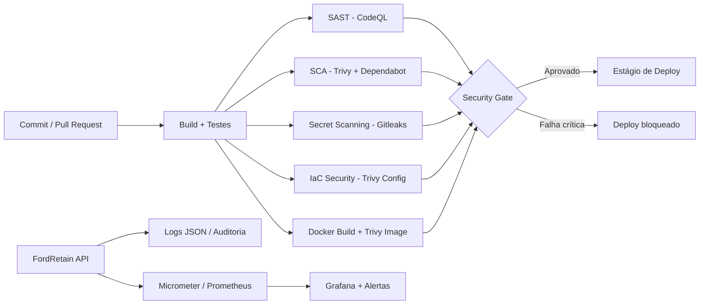

# FordRetain — Sprint 3 Cybersecurity

Implementação da **Sprint 3 de Cybersecurity** do Ford Challenge, evoluindo a API FordRetain para um modelo **DevSecOps**: segurança é verificada desde o commit/PR até o gate de deploy, com hardening de API e infraestrutura, observabilidade, resposta a incidentes, gestão de riscos e conformidade.

> Documento principal da entrega: [`docs/SPRINT3_CYBERSECURITY.md`](docs/SPRINT3_CYBERSECURITY.md)

## 1. O que esta entrega cobre

| Rubrica | Implementação / evidência no repositório |
|---|---|
| Pipeline DevSecOps — 3,0 | GitHub Actions, Maven, CodeQL, Trivy SCA, Dependabot, Gitleaks, Trivy Container, Trivy IaC, SBOM CycloneDX e security gate |
| Segurança em Código e Infra — 2,5 | JWT HS512, RBAC, validação, rate limit, CORS restrito, AES-GCM, secrets externos, Docker non-root e Kubernetes hardened |
| Observabilidade e Resposta — 2,0 | logs JSON, request ID, métricas Micrometer/Prometheus, alertas, dashboard Grafana e fluxo de resposta a incidentes |
| Compliance e Segurança Contínua — 2,5 | STRIDE, OWASP ASVS, OWASP API Top 10, OWASP Mobile Top 10, LGPD, rotina de revisão, backup e checklist |

## 2. Arquitetura de segurança



## 3. Estrutura

```text
.
├── .github/
│   ├── dependabot.yml
│   └── workflows/security-pipeline.yml
├── docs/
│   └── SPRINT3_CYBERSECURITY.md
├── evidencias/
│   └── README.md
├── k8s/
│   └── fordretain-api.yaml
├── monitoring/
│   ├── docker-compose.monitoring.yml
│   ├── prometheus/
│   └── grafana/
├── src/main/java/com/ford/fordretain/
│   ├── controller/
│   ├── dto/
│   └── security/
├── src/main/resources/
├── Dockerfile
├── pom.xml
└── README.md
```

## 4. Pipeline DevSecOps

Arquivo: [`.github/workflows/security-pipeline.yml`](.github/workflows/security-pipeline.yml)

Fluxo:

`Commit/PR → Build/Testes/SBOM → SAST → SCA → Secret Scanning → IaC Scan → Container Scan → Security Gate → Deploy`

### Gates implementados

- **Build/Testes:** `mvn clean verify`.
- **SBOM:** CycloneDX em `target/bom.json`, publicado como artefato do GitHub Actions.
- **SAST:** CodeQL para Java.
- **SCA:** Trivy filesystem + Dependabot semanal.
- **Secret scanning:** Gitleaks com histórico Git.
- **IaC Security:** Trivy Config em Docker/Kubernetes.
- **Container Security:** build da imagem + relatório HIGH/CRITICAL + bloqueio de CRITICAL.
- **Gate final:** só é executado quando todos os jobs obrigatórios passam.

## 5. Segurança da API

### JWT
- assinatura HS512;
- chave mínima de 64 bytes;
- expiração configurável;
- segredo somente por variável de ambiente;
- validação de assinatura e expiração a cada requisição.

### RBAC
Perfis do domínio FordRetain:

| Perfil | Acesso principal |
|---|---|
| `ADMIN` | administração, DELETE e endpoints protegidos do Actuator |
| `GERENTE` | predição, dashboard, leitura e alteração de clientes |
| `ANALISTA` | consultas e leads |

Os nomes `Brigadista / Gestor / Administrador` presentes no enunciado são exemplos de perfis. No domínio FordRetain, a separação equivalente é `ANALISTA / GERENTE / ADMIN`.

### Hardening
- validação Jakarta Bean Validation;
- login com tamanho máximo de senha;
- Bucket4j para rate limiting geral e específico do login;
- HTTP 429 + `Retry-After`;
- CORS por allowlist de origens;
- BCrypt para senha;
- AES-GCM para campo sensível;
- logs sem senha, JWT ou segredo;
- mensagens de login sem enumeração de usuário.

## 6. Infraestrutura segura

### Docker
- multi-stage build;
- JRE no runtime;
- atualização de pacotes de segurança do Alpine;
- usuário sem privilégios;
- healthcheck;
- nenhuma credencial embutida na imagem.

### Kubernetes
O manifesto [`k8s/fordretain-api.yaml`](k8s/fordretain-api.yaml) inclui:
- `runAsNonRoot`;
- `allowPrivilegeEscalation: false`;
- `readOnlyRootFilesystem: true`;
- `capabilities.drop: ALL`;
- `seccompProfile: RuntimeDefault`;
- secrets por `SecretKeyRef`;
- probes de readiness/liveness;
- requests/limits de CPU e memória;
- `automountServiceAccountToken: false`.

## 7. Observabilidade

A aplicação expõe métricas pelo Actuator/Micrometer e o ambiente de monitoramento contém **Prometheus + Grafana**.

Métricas de segurança principais:
- `fordretain_security_login_total{result="success|failure"}`;
- `fordretain_security_access_denied_total`;
- `fordretain_security_rate_limited_total`;
- métricas HTTP/JVM padrão do Spring Boot Actuator.

O dashboard provisionado fica em `monitoring/grafana/dashboards/fordretain-security.json`.

### Executar monitoramento

1. Execute a API na porta `8080`.
2. Entre em `monitoring/`.
3. Copie `.env.example` para `.env` e defina uma senha local para o Grafana.
4. Execute:

```bash
docker compose -f docker-compose.monitoring.yml up -d
```

5. Prometheus: porta `9090`.
6. Grafana: porta `3000`.

## 8. Variáveis obrigatórias

Nunca versione valores reais.

```text
ORACLE_URL
ORACLE_USER
ORACLE_PASSWORD
JWT_SECRET        # mínimo de 64 bytes para HS512
CRYPTO_SECRET
CRYPTO_SALT
CORS_ALLOWED_ORIGINS
```

O arquivo de testes usa somente valores próprios de teste; secrets de produção não são necessários para executar CI de PR.

## 9. MQTT/TLS e módulos externos

**MQTT/TLS não é implementado como evidência executável neste repositório**, porque o FordRetain API aqui versionado não possui módulo IoT/MQTT. O documento registra o requisito como **não aplicável ao escopo atual**, evitando apresentar uma configuração fictícia como se estivesse em produção.

Da mesma forma, controles específicos do aplicativo mobile e do modelo de ML devem ser instrumentados nos respectivos módulos quando integrados; este repositório cobre a API e os artefatos de infraestrutura/monitoramento presentes aqui.

## 10. Evidências para a entrega

Não são usados prints fabricados. Após a execução real, salvar em `evidencias/`:

- pipeline completo e gate final;
- CodeQL/SAST;
- SCA/Trivy;
- Gitleaks;
- Trivy Container;
- Trivy IaC;
- artefato SBOM CycloneDX;
- dashboard Grafana;
- exemplo de log JSON;
- métricas/alertas Prometheus.

O roteiro exato está em [`evidencias/README.md`](evidencias/README.md).

## 11. Documento consolidado

[`docs/SPRINT3_CYBERSECURITY.md`](docs/SPRINT3_CYBERSECURITY.md) contém as quatro atividades exigidas pela rubrica, o vínculo entre controles e riscos, STRIDE, OWASP, LGPD, segurança contínua e checklist final.

## Aviso

Este projeto é acadêmico. Credenciais, tokens, chaves e dados pessoais reais não devem ser commitados. O pipeline foi configurado para bloquear falhas críticas e para tornar as evidências de segurança reproduzíveis.
