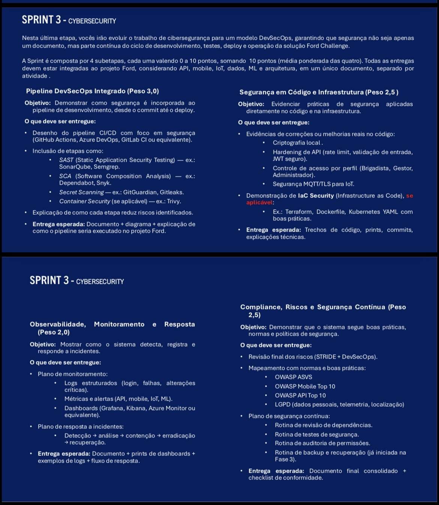

# Relatório Final da Sprint 3 de Cybersecurity

## 1. Objetivo e resultado

A Sprint 3 evolui o FordRetain para um fluxo DevSecOps verificável. O repositório reúne controles de autenticação e autorização, proteção contra abuso, criptografia, pipeline de segurança, hardening de infraestrutura, observabilidade, resposta a incidentes e conformidade.

O resultado combina implementação executável, testes automatizados, documentação técnica e evidências reais. Os itens que dependem de módulos externos, como aplicativo mobile, IoT e modelo de machine learning, são tratados como requisitos de integração e não como funcionalidades já implementadas nesta API.

## 2. Entregas por bloco da rubrica

| Bloco | Implementação principal | Evidência |
|---|---|---|
| Pipeline DevSecOps | Maven, SBOM CycloneDX, CodeQL, Trivy SCA, Dependabot, Gitleaks, Trivy IaC, Trivy Container e gate final | workflow, histórico do Actions e artefato SBOM |
| Código e infraestrutura | JWT HS512, BCrypt, RBAC, validação, rate limiting, CORS, AES-GCM, Docker non-root e Kubernetes hardened | código, testes, manifestos e prints do Swagger |
| Observabilidade e resposta | logs JSON, request ID, métricas Micrometer, Prometheus, Grafana, alertas e fluxo de incidentes | configurações versionadas e evidências de execução |
| Compliance e segurança contínua | STRIDE, OWASP ASVS, OWASP API Security Top 10, OWASP Mobile Top 10, LGPD, ISO 27001, NIST CSF e rotinas de revisão | documento consolidado e checklist |

## 3. Evidências reais disponíveis

As evidências adicionadas ao repositório comprovam:

- estrutura organizada do projeto;
- pipeline completo com os sete jobs aprovados e gate final liberado;
- SAST/CodeQL, SCA/Trivy, Gitleaks, Trivy IaC e Trivy Container aprovados;
- geração e validação da SBOM CycloneDX;
- execução de testes Maven com `BUILD SUCCESS`;
- login dos perfis ADMIN e GERENTE pelo Swagger;
- emissão de JWT em requisição válida;
- validação de entrada com resposta HTTP 400;
- target da API em estado `UP` no Prometheus, dashboard Grafana e alertas carregados;
- logs JSON sanitizados com request ID;
- RBAC retornando HTTP 403 e rate limit retornando HTTP 429 com `Retry-After`.

Os arquivos estão catalogados em [`evidencias/README.md`](../evidencias/README.md). As capturas do pipeline correspondem à PR #22 / Security Pipeline / run #42; as evidências reproduzíveis de runtime correspondem à Runtime Evidence / run #6. Tokens apresentados nos prints são de demonstração local e já expirados; nenhuma credencial de produção foi incluída.

## 4. Testes automatizados

O build executa testes de integração e unidade para os controles críticos:

| Cenário | Resultado esperado |
|---|---|
| login válido | HTTP 200, JWT e perfil correto |
| credencial inválida | HTTP 401 sem enumeração de usuário |
| payload inválido | HTTP 400 |
| rota protegida sem token | HTTP 401 |
| ANALISTA em rota administrativa | HTTP 403 |
| ADMIN em rota administrativa | HTTP 200 |
| token inválido | HTTP 401 |
| coleta Prometheus | HTTP 200 |
| excesso de tentativas | HTTP 429 e `Retry-After` |

O perfil `local` usa H2 em memória e permite executar a demonstração sem uma instância Oracle. O perfil padrão continua preparado para receber conexão e secrets externos em ambientes controlados.

## 5. Arquitetura e escopo integrado

| Componente | Cobertura atual | Controle de segurança |
|---|---|---|
| API Java | implementado neste repositório | JWT, RBAC, validação, rate limit, criptografia, logs e métricas |
| Dados Oracle | configuração de integração | credenciais externas, acesso mínimo, criptografia e backup operacional |
| Mobile | repositório externo | armazenamento seguro, proteção de token, certificate pinning quando aplicável e telemetria |
| IoT | não presente neste código | MQTT sobre TLS, identidade por dispositivo, autorização por tópico e rotação de certificados |
| Machine learning | não presente neste código | controle de acesso ao modelo, versionamento, integridade, drift e monitoramento de inferência |

Essa separação evita afirmar como concluído um controle que não pode ser demonstrado neste repositório, sem deixar de registrar o desenho necessário para a solução integrada.

## 6. Pontos técnicos melhorados

- Dependência H2 adicionada para testes e demonstração local isolada.
- Perfil `local` criado sem alterar a configuração Oracle do ambiente principal.
- Endpoint Prometheus compatibilizado com o coletor local; os demais endpoints do Actuator permanecem restritos a ADMIN.
- Testes ampliados para autenticação, validação, JWT, RBAC, Prometheus e rate limiting.
- Evidências renomeadas de forma descritiva e vinculadas à rubrica.
- Contexto de ativos, continuidade, ISO 27001, NIST CSF e Red/Blue Team incorporado ao documento consolidado.

## 7. Evidências de execução anexadas

O conjunto visual da entrega está completo e inclui:

1. GitHub Actions com todos os jobs e o gate final aprovados;
2. build, nove testes e SBOM CycloneDX;
3. CodeQL, Trivy SCA, Gitleaks, Trivy IaC e Trivy Container;
4. target do Prometheus em estado `UP` e regras de alerta carregadas;
5. dashboard Grafana com os valores coletados;
6. log JSON de auditoria sanitizado;
7. teste de RBAC com HTTP 403;
8. teste de rate limit com HTTP 429 e `Retry-After`.

Esses itens foram obtidos de execuções reais e permanecem reproduzíveis pelos workflows versionados.

## 8. Conclusão

A entrega cobre os quatro blocos da Sprint 3 com rastreabilidade entre requisito, implementação e evidência. A API possui controles concretos e testáveis, o pipeline impede a promoção de artefatos com falhas críticas, a infraestrutura aplica hardening e a documentação estabelece monitoramento, resposta, continuidade e governança. Os limites de escopo de mobile, IoT e ML permanecem explicitados para preservar a precisão técnica da entrega.
